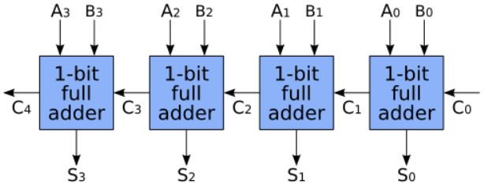

# Binary arithmetic

A bit is a single binary value that can be either 0 or 1. A binary digital computer consists of circuits that take bits as input and return bits as output.

For example, an **XOR gate** is a circuit that takes 2 input bits ($A$ and $B$) and returns 1 output bit ($S$). The output bit is 1 if exactly 1 of the input bits is 1 and 0 otherwise. Here is the output for each of the possible inputs:

|$A$|$B$|$S$|
|-|-|---|
|0|0|0|
|1|0|1|
|0|1|1|
|1|1|0|

We can think of the XOR gate as computing the sum of its inputs modulo 2, where $1+1$ "wraps around" from 2 back to 0.

As another example, a **half adder** is a circuit that takes 2 input bits ($A$ and $B$) and returns 2 output bits ($S$ and $C$) encoding the sum of the inputs as $2C + S$. Here are the outputs (and the sum) for each of the possible inputs:

|$A$|$B$|$S$|$C$|$2C + S$|
|---|---|---|---|--------|
|0|0|0|0|0|
|1|0|1|0|1|
|0|1|1|0|1|
|1|1|0|1|2|

The half adder feeds the 2 input bits through an XOR gate as before, which gives us $S$. The half adder also feeds the 2 input bits through an AND gate, which returns 1 if all of its inputs are 1 and returns 0 otherwise. The AND gate gives us $C$.

We can think of $C$ as part of the encoding of the sum of the inputs. Alternatively, we can think of $C$ as a carry bit representing the value that needs to be "carried over" to the next bit position when adding 2 binary digits (just as we "carry the 1" when we add 2 decimal digits whose sum exceeds 10).

A **full adder** is a circuit that takes 3 bits ($A$, $B$ and an input carry bit $C_{in}$) and returns a sum bit $S$ and an output carry bit $C_{out}$. The full adder performs one step of the process of adding 2 binary numbers digit by digit. For example, consider adding the bits 1001 and 0011:

```
carry: 00110
        1001
       +0011
        ----
        1100
```

At each step, we compute the sum of the 2 binary digits in a column with the carry bit from the last step (or the carry bit of 0 at the first step).

Here are the outputs of the full adder for each of the possible inputs:

|$A$|$B$|$C_{in}$|$S$|$C_{out}$|
|-|-|---|-|----|
|0|0|0|0|0|
|0|0|1|1|0|
|0|1|0|1|0|
|0|1|1|0|1|
|1|0|0|1|0|
|1|0|1|0|1|
|1|1|0|0|1|
|1|1|1|1|1|

We build a full adder from 2 half adders. The first half adder takes $A$ and $B$ as input and outputs $S_0$ and $C_0$. The second half adder takes $S_0$ and $C_{in}$ as input and outputs $S$ and $C_1$. We then feed $C_0$ and $C_1$ through an OR gate, which returns 1 if any of its inputs are 1 and returns 0 otherwise. The output of the OR gate gives us $C_{out}$.

An **adder** is a circuit that takes 2 $n$-bit inputs ($A_0, A_1, \ldots, A_{n-1}$ and $B_0, B_1, \ldots, B_{n-1}$) and returns an $n+1$-bit output ($S_0, S_1, \ldots, S_{n-1}, S_n$). We interpret the first input as the integer $\sum_{i=0}^{n-1} A_i 2^i$ and the second input analogously. The output bits encode the sum of these 2 integers as $\sum_{i=0}^n S_i 2^i$. We distinguish the $S_n$ bit as the carry bit $C$. We then interpret the adder as returning the lower $n$ bits of the sum and a carry bit, which if set signals an "overflow" error, where the number of bits required to represent the sum exceeds the number of bits required to represent each input.

For example, here is an adder that takes 2 4-bit inputs and returns a 4-bit sum and the 1-bit carry:



In the description above for the adder, we interpret the input $A_0, A_1, \ldots, A_{n-1}$, the input $B_0, B_1, \ldots, B_{n-1}$ and the output $S_0, S_1, \ldots, S_{n-1}$ as unsigned integers (i.e., non-negative integers). Alternatively, we can interpret them as signed integers (i.e., negative or non-negative integers) using **Two's complement**, where the $n$ bits $x_0, x_1, \ldots, x_{n-1}$ encode the integer $-x_{n-1} 2^{n-1} + \sum_{i=0}^{n-2} x_i 2^i$. The $S_0, \ldots, S_{n-1}$ still encode the lower $n$ bits of the sum of the inputs. However, $S_0, \ldots, S_{n-1}, C$ no longer encodes all the bits of the sum and $C = 1$ no longer indicates an overflow error. For example, take the case of $A_0 = 1$, $A_1 = 1$, $A_2 = 1$ and $A_3 = 1$ and $B_0 = 1$, $B_1 = 0$, $B_2 = 0$ and $B_3 = 0$:

```
carry: 11110
        1111
       +0001
        ----
        0000
```

The adder returns $S_0 = 0$, $S_1 = 0$, $S_2 = 0$, $S_3 = 0$ and $C = 1$. If we interpret the 4-bit inputs and the 4-bit output as unsigned integers, then $C$ indicates the overflow error, where (8 + 4 + 2 + 1) + (0 + 0 + 0 + 1) = 16, which requires 5 bits to represent. However, if we interpret them as signed integers, then $C$ does not indicate an overflow error. We expect the sum to be (-8 + 4 + 2 + 1) + (0 + 0 + 0 + 1) = 0. For signed integers, an $n$-bit adder overflows when the sum falls outside the range that can be represented with $n$ bits in Two's complement. In this case, the adder raises an overflow error when the last carry in bit does not equal the last carry out bit.

To use the adder to subtract the second input from the first, we feed the second input through a NOT gate to flip all of its bits. We then feed the first input and the inverted second input into the adder with the first carry in bit set to 1. In general, if a sequence of bits encodes the unsigned integer $y$, then the sequence of bits obtained by flipping each bit in that sequence and adding 1 will encode $-y$ in Two's complement.

Finally, an **Arithmetic Logic Unit (ALU)** is a circuit that takes 2 $n$-bit inputs along with control bits and returns an $n$-bit output and status flag bits. The control bits determine the operation that the ALU performs. For example, a simple ALU might perform the following operations on inputs $x$ and $y$: $0$, $1$, $-1$, $x$, $y$, $\neg x$, $\neg y$, $-x$, $-y$, $x + 1$, $y + 1$, $x - 1$, $y - 1$, $x + y$, $x - y$, $y - x$, $x \land y$, $x \lor y$. The status flag bits indicate, for example, an unsigned overflow error or a signed overflow error.

## Sources

* [Adder (electronics) - Wikipedia](https://en.wikipedia.org/wiki/Adder_(electronics))
* Chapter 2. The Elements of Computing Systems, 2nd Edition
