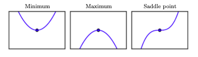
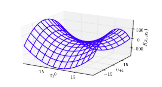

# Critical points

The **derivative** of the function $f'(x)$ gives the slope of the tangent line to the graph of the function at the point $x$. It measures the effect of a small change in the input to the function on the output of the function, i.e., $f(x + \epsilon) \approx f(x) + \epsilon f'(x)$.

A point $x$ where the derivative $f'(x) = 0$ is called a **critical point**. A critical point may be a **maximum**, a **minimum** or a **saddle point**. See Figure 4.2 from Goodfellow:

The **second derivative** of the function $f''(x)$ "measures how the rate of change of a quantity is itself changing" (https://en.wikipedia.org/wiki/Second_derivative).

If the second derivative at the point $f''(x) \gt 0$, then "the first derivative $f'(x)$ increases as we move to the right and decreases as we move to the left...In other words, as we move right, the slope begins to point uphill to the right, and as we move left, the slope begins to point uphill to the left" (Goodfellow). Therefore, when $f'(x) = 0$ and $f''(x) \gt 0$, $x$ is a minimum. Similarly, when $f'(x) = 0$ and $f''(x) \gt 0$, $x$ is a maximum. When $f'(x) = 0$ and $f''(x) = 0$, then the **second derivative test** is inconclusive and "$x$ may be a saddle point or a part of a flat region" (Goodfellow).

For a function $f(\textbf{x})$ that takes a vector $\textbf{x}$ as an input, we can compute the **gradient** $\nabla f(\textbf{x})$ with respect to $\textbf{x}$. The gradient is a vector, where the $i$th component is equal to the partial derivative $\frac{\partial d f}{\partial d x_i}$. The $i$th component measures the effect of a small change in the $i$th input to the function on the output of the function.

Like in the univariate case, $\textbf{x}$ is a critical point if $\nabla f(\textbf{x}) = 0$.

The **Hessian** of the function $\textbf{H}(f)(\textbf{x})_{i,j} = \frac{\partial^2}{\partial x_i \partial x_j} f(\textbf{x})$. The Hessian is the **Jacobian** of the gradient. We can use the Hessian to get the second derivative in a specific direction: "The second derivative in a specific direction represented by a unit vector $\textbf{d}$ is given by $\textbf{d}^T \textbf{H} \textbf{d}$. When $\textbf{d}$ is an eigenvector of $\textbf{H}$, the second derivative in that direction is given by the corresponding eigenvalue. For other directions of $\textbf{d}$, the directional second derivative is a weighted average of all the eigenvalues, with weights between 0 and 1, and eigenvectors that have a smaller angle with $\textbf{d}$ receiving more weight. The maximum eigenvalue determines the maximum second derivative, and the minimum eigenvalue determines the minimum second derivative" (Goodfellow). We know that the Hessian has an eigendecomposition, because it is a real, symmetric matrix.

If the Hessian is positive definite, i.e., all the eigenvalues are positive, then the second derivative in any direction must be positive (the second derivative is a weighted average of the eigenvalues of the Hessian). Therefore, when $\nabla f(\textbf{x}) = 0$ and the Hessian is positive definite, $\textbf{x}$ is a minimum. Similarly, when $\nabla f(\textbf{x}) = 0$ and the Hessian is negative definite, $\textbf{x}$ is a maximum. If some eigenvalues are positive and some are negative, then "$\textbf{x}$ is a local maximum on one cross section off but a local minimum on another cross section. See Figure 4.5 for an example" (Goodfellow).

The multivariate second derivative test "is inconclusive whenever all the nonzero eigenvalues have the same sign but at least one eigenvalue is zero. This is because the univariate second derivative test is inconclusive in the cross section corresponding to the zero eigenvalue" (Goodfellow).

## Sources

* * Goodfellow, Deep learning, Section 4.3