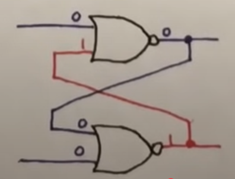

# Flip-flops

If a computer can persist the values of bits over time, then it can chain operations together in a sequence by, for example, feeding numbers through an Arithmetic Logic Unit, writing the output to its memory, reading the output from its memory, checking if the output meets some condition and then performing one or another arithmetic operation based on the result. Otherwise, the computer is limited to what it can do in a single pass.

We first build a circuit to persist the value of a single bit. The idea is to create a circuit with 2 stable states like a light switch, which when flipped on stays on until we flip it off (or when flipped off stays off until we flip it on). We do so by introducing a feedback loop, where we feed the circuit's output back into its input, which persists the state of circuit until a new input overpowers the feedback loop to change the circuit's state.

A circuit that contains a feedback loop is called a **sequential circuit** in contrast to a **combinatorial circuit** without feedback loops (e.g., an Arithmetic Logic Unit or Floating-Point Unit).

Consider an OR gate that takes inputs $A$ and $B$ and returns a high signal if $A$ has a high signal or $B$ has a high signal (or both have a high signal) and returns a low signal otherwise. Add a wire that also feeds the output back into one of the inputs (say the input $B$) instead of that input being determined by an external source.

This **OR gate with feedback** starts with $A$ and $B$ having a low signal. The OR gate outputs a low signal, that low signal feeds back into $B$ and the OR gate continues to output a low signal. If we then send a high signal through $A$, the OR gate outputs a high signal, that high signal feeds back into $B$ and the OR gate continues to output a high signal. If we then try remove the high signal flowing through $A$, the OR gate continues to output a high signal (because of the high signal feeding back into $B$), that high signal continues to feeds back into $B$ and the OR gate continues to output a high signal. In this way, the OR gate "locks in" the first high signal sent through $A$.

Now consider the **SR latch**:

It has a Reset input ($R$), a Set input ($S$), an output ($Q$) and the complement of that output ($\bar{Q}$). The SR latch starts with $R$ and $S$ having a low signal. If both inputs to a NOR gate have a low signal, then a NOR gate will output a high signal. Otherwise, a NOR gate will output a low signal. The SR latch starts with all the inputs having low signal suggesting that both of the NOR gates will output a high signal. However, one of the NOR gates will start outputting a high signal a little bit before the other NOR gate. Suppose the top NOR gate starts outputting a high signal first. In this case, that high signal is fed back into the bottom NOR gate, that bottom NOR gate outputs a low signal, that low signal is fed back into the top NOR gate and that top NOR gate continues to output a high signal. In this way, the top NOR gate outputs a high signal ($Q$) at the start and the bottom NOR outputs a low signal ($\bar{Q}$) at the start.

If the bottom NOR gate had instead started outputting a high signal before the top NOR gate, then the bottom NOR gate would output a high signal ($\bar{Q}$) at the start and the top NOR gate would output a low signal ($Q$) at the start.

Suppose that the top NOR gate is outputting a high signal and the bottom NOR is outputting a low signal. If we send a high signal through $R$, then the top NOR gate starts outputting a low signal, that low signal feeds back into the bottom NOR gate, the bottom NOR starts outputting a high signal, that high signal feeds back into the top NOR gate and the top NOR gate continues to output a low signal. In this way, the top NOR gate outputs a low signal ($Q$) and the bottom NOR gate outputs a high signal ($\bar{Q}$) after sending a high signal through $R$.

If we send a high signal through $S$, then the bottom NOR gate continues to output a low signal, the top NOR gate continues to output a high signal ($Q$) and the bottom NOR gate continues to output a low signal ($\bar{Q}$).

In general, if we send a high signal through $R$, then the SR latch will continue to output a low signal ($Q$) irrespective of the signal flowing into $R$ after as long as the low signal into $S$ continues. If we send a high signal through $S$, then the SR latch will continue to output a high signal ($Q$) irrespective of the signal flowing through $S$ after as long as the low signal into $R$ continues. We consider the case of a high signal flowing through both $R$ and $S$ to be invalid.

The SR latch takes 2 NOR gates and feeds the output of each into the input of the other. When 1 of the gates outputs a high signal, it forces the other gate to output a low signal, which keeps the first gate outputting a high signal and so on. The SR latch has 2 states depending on which one of the 2 gates is outputting the high signal. The feedback loop locks the SR latch in its last state. The $S$ input overpowers the feedback loop to have the gate connected to it output the high signal. The $R$ input overpowers the feedback loop to have the gate connected to it output the high signal.

The **D latch** is like an SR latch, but instead of having a Set input and a Reset input, it has one input ($D$) where a high signal for that input gives the Set operation and a low signal for that input gives the Reset operation. It also has an Enable input ($EN$). The output only changes when the Enable input has a high signal.

The **D flip-flop** adds a small circuit before the Enable input of the D latch that takes as input a clock signal (a voltage that oscillates between a high and low signal at a constant frequency) and outputs a pulse on the rising edge of the clock's waveform:

This frame shows the waveforms of the clock, Enable, D and Q for the D flip-flop ($\bar{Q}$ is ignored):

The D flip-flop persists the input value until the next clock tick. It ignores changes in between the clock ticks.

## Sources

* [SR latch - Ben Eater](https://www.youtube.com/watch?v=KM0DdEaY5sY)
* [D latch - Ben Eater](https://www.youtube.com/watch?v=peCh_859q7Q)
* [D flip - Ben Eater](https://www.youtube.com/watch?v=YW-_GkUguMM)