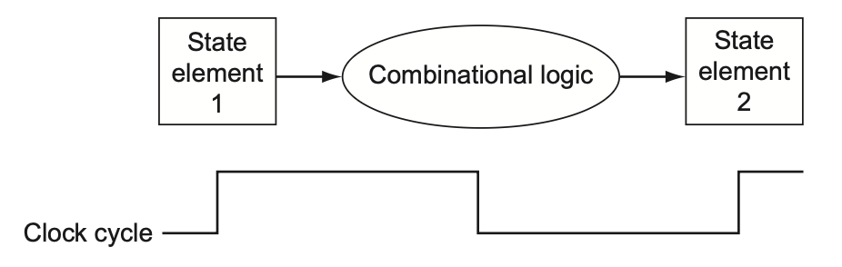

# Synchronous systems

Consider a NOT gate with an input $x$ and an output $y$, where the input is determined by a button. While we press and hold the button down, $x$ is 1. Otherwise, $x$ is 0.

We start at $t = 0$ with $x = 0$ and $y = 1$. At $t = 2$, we press and hold the button down. Suppose further that it takes 2 time steps for the input signal to propagate through the NOT gate to the output signal. We then have the following sequence of events:

```
      *
t 0 1 2 3 4 5 6 7 8
x 0 0 1 1 1 1 1 1 1
y 1 1 1 1 0 0 0 0 0
      ^ ^

* the button state changes
^ incorrect output
```

If we look at the output of the NOT gate when $t \in \{2, 3\}$, then we get an incorrect value.

To fix this issue, we feed the input signal $x$ into a D flip-flop that has state $x'$ and the output signal $y$ into a D flip-flop that has state $y'$:

```
x -> x' -> NOT -> y -> y'
```

Recall that a D flip-flop takes a 1-bit data input and a 1-bit clock input and returns a 1-bit output. The value of the output only changes at the rising edge of the clock's waveform. Otherwise, the value is locked into the value at the time of the last rising edge.

Let $c$ be a binary variable indicating when we have a rising edge. Suppose that the clock has a rising edge every 4 time steps.

In that case, we have:

```
       *
t  0 1 2 3 4 5 6 7 8
x  0 0 1 1 1 1 1 1 1
c  1 0 0 0 1 0 0 0 1
x' 0 0 0 0 1 1 1 1 1
y  1 1 1 1 1 1 0 0 0
           ^ ^
y' 1 1 1 1 1 1 1 1 0

* the button state changes
^ incorrect output
```

Restricting our attention to the values of $x'$ and $y'$ at the clock's rising edge (and with $t_c$ denoting the clock cycle):

```
t   0 4 8
t_c 0 1 2
x'  0 1 1
y'  1 1 0
```

As long as the clock period exceeds the propagation delay, $y'$ at clock cycle $t_c+1$ will be $\neg x'$ at clock cycle $t_c$. To see that, let $C$ be the clock period and $P$ be the propagation delay. Suppose $x'$ has last updated to $V$ at time $t$. At time $t+P$, $y$ updates to $\neg V$. At time $t+C$, $y'$ updates to $y$. Since $C > P$, $t+C > t+P$, $y$ is $\neg V$ and $y'$ is set to the value of $x'$ at the last update.

More generally, we synchronize the combinational circuits in a computer (e.g., the Arithmetic Logic Unit, the Floating-Point Unit, etc.) by having flip-flops feed into combinational circuits, which feed into flip-flops:



## Sources

* [Lecture 10 - UC Berkeley, CS61C, Spring 2015](https://www.youtube.com/watch?v=GCWcJ-Ng9EA&list=PLhMnuBfGeCDM8pXLpqib90mDFJI-e1lpk&index=10)
* Chapters 4.2, B.3 - Computer Organization and Design, Fifth Edition
* Chapter 2 - The Elements of Computing Systems, 2nd Edition