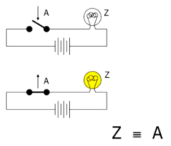
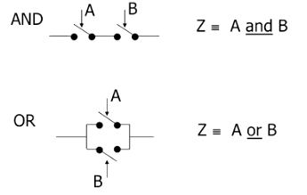

# Transistors

We can build a computer out of all manner of physical media, including [dominoes](https://www.youtube.com/watch?v=OpLU__bhu2w), [marbles](https://www.youtube.com/watch?v=8BOvLL8ok8I) and [water](https://www.youtube.com/watch?v=IxXaizglscw), but using electronic components has a number of advantages (for one, an electric current moves faster than a cascade of falling dominoes).

To build an electronic computer, we use a kind of **switch**, or electronic component with a gate that, when closed, allows current to flow through the circuit and, when open, blocks current from flowing through the circuit.

In particular, we use a kind of switch called a **transistor** whose gate can be opened or closed by an electrical signal rather than a mechanical action.

We compose transistors to build logic gates. For example (though simplified for pedagogical purposes), we can arrange 2 transistors in series to build an AND gate, which takes 2 boolean inputs and returns true if both inputs are true and false otherwise. Or we can arrange 2 transistors on parallel tracks to build an OR gate, which takes 2 boolean inputs and returns true if either input is true or both inputs are true and false otherwise.

With a large number of transistors, we can build a general-purpose computer. The more transistors, the more operations the computer can perform per second. From the 1970s to the 2010s, the number of transistors in a computer has doubled roughly every 2 years ([Moore's Law](https://en.wikipedia.org/wiki/Moore's_law) is the observation of this trend though the pace started to slow in the 2010s). As of 2025, a computer has billions of transistors (e.g., the [Apple M3 Ultra](https://en.wikipedia.org/wiki/Apple_M3) computer chip has 184 billion transistors).

## Additional topics

* How to build a NOT gate from transistors

## Sources

* [Lecture 9 - UC Berkeley, CS61C, Spring 2015](https://www.youtube.com/watch?v=zpGzXfWRk70&list=PLhMnuBfGeCDM8pXLpqib90mDFJI-e1lpk&index=9))