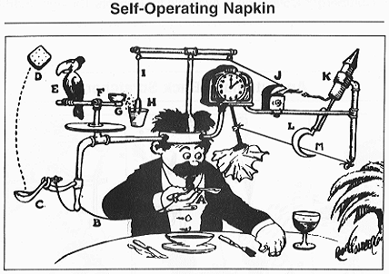
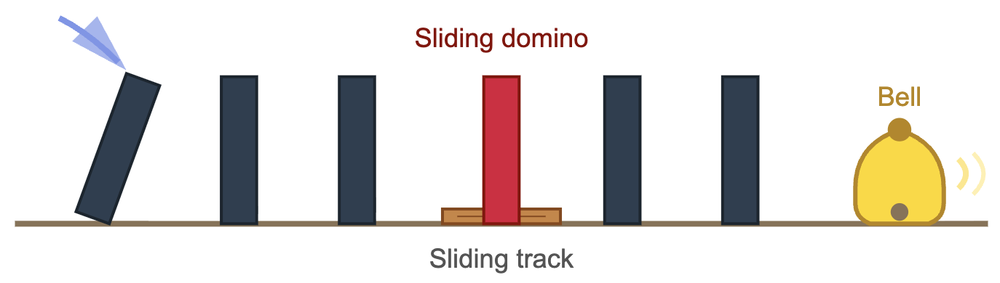
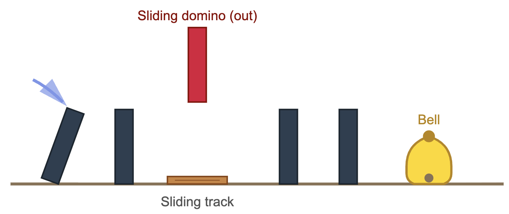
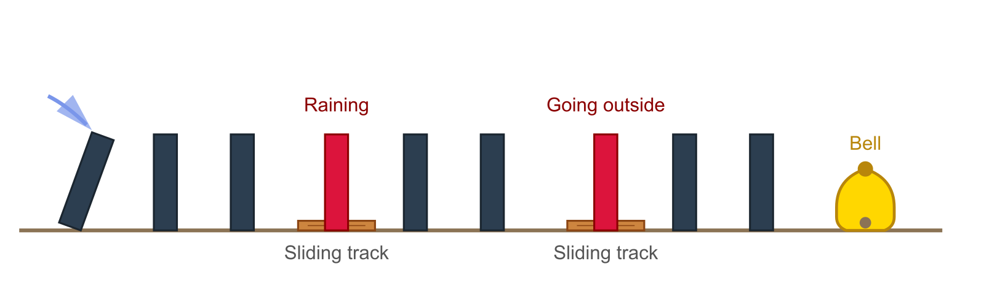
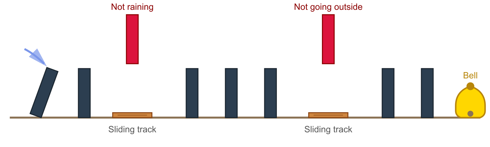
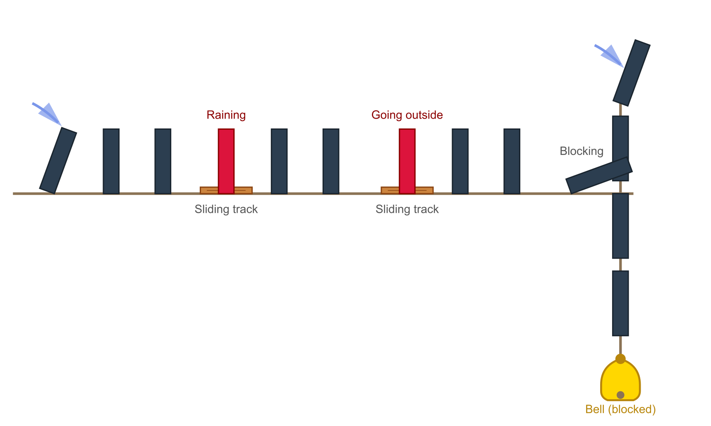

# What is a computer?

A computer is like a Rube Goldberg machine: a contraption that performs a task through an elaborate chain reaction of physical events. It starts off with a domino falling over, a marble rolling down a ramp or a lever being pulled. It ends with the ringing of a bell, the lighting of a candle or the dispensing of toothpaste. In the case of the computer, we set up this contraption so as to provide the answer to a logical or arithmetic question.

For example, suppose we need an umbrella if it's raining. We can design a contraption to answer the logical question of whether or not we need an umbrella based on whether or not it's raining. To do so, we arrange a set of dominoes in a line. We place the domino in the middle of the line on a sliding track. To start the contraption, we tip the domino at the head of the line.

If it's raining, we slide the middle domino into its place in line. When the domino at the head of the line falls, all the dominoes eventually fall, including the last one, which rings the bell signalling we need an umbrella.

Otherwise, the first half of the line falls, but not the second half, because of the gap in the middle of the line, and the bell does not ring. The contraption answers the logical question.

Building on this example, suppose instead we need an umbrella if it's raining and we plan to go outside. To do so, we arrange a set of dominoes in a line with the middle domino on a sliding track as before. We then set up a second set up of dominoes in the same way after the first line. We place a bell at the end of the second line. To start this compound contraption, we tip the domino at the head of the first line.

If it's raining, we slide the middle domino in the first line into place. If we plan to go outside, we slide the middle domino in the second line into place. When the domino at the head of the first line falls, all the dominoes eventually fall, including the last one, which rings the bell signalling we need an umbrella.

Otherwise, the bell does not ring. This compound contraption answers the more complex logical question.

Finally, suppose instead we want the bell to ring if we don't need the umbrella. We add a line of dominoes perpendicular to the second line and we move the bell to the end of this perpendicular line. To start the contraption, we tip the domino at the head of the first line and then we tip the domino at the head of the perpendicular line. If the last domino of the second line falls, then it blocks the dominoes in the perpendicular line from falling and the bell does not ring. 

If the last domino of the second line does not fall, then it does not block the dominoes in the perpendicular line and the last domino in that line rings the bell.

This last contraption is a NAND gate. A NAND gate takes 2 binary inputs and outputs true if the inputs are both false and outputs false otherwise. In this case, the first input is whether or not it's raining and the second binary input is whether or not we plan to go outside. The output is whether or not we need an umbrella. It turns out that a collection of NAND gates can answer any logical or arithmetic question that a modern computer can.

## Sources

* [Rube Goldberg machine - Wikipedia](https://en.wikipedia.org/wiki/Rube_Goldberg_machine)

